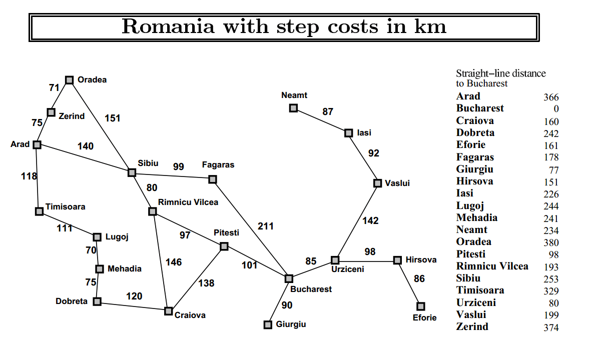

# Lab 2
## Searching Algorithms


  

### Contents
* [Puzzle Solving](#puzzle)
* [Romanian Paths](#path)
___

<a name="puzzle"></a>
## Puzzle Solving
Apply the following alogrithms for 8 and 15 puzzle problem:
* Breadth-first search
* Depth-first search
* Greedy search
* A-star search

For 8-puzzle:  
```
 python puzzle8_solver.py --search <search alogorithm> [--depth] <depth limit>
```
* Input file: `input_8.txt`
* Output file: `out.txt`

For 15-puzzle:  
```
 python puzzle15_solver.py --search <search alogorithm> [--depth] <depth limit>
```
* Input file: `input_15.txt`
* Output file: `out.txt`

**Options:**
* `-s --search`&nbsp;&nbsp;Search alogrithm to run to solve the puzzle (`bfs`, `dfs`, `best_first`, `a_star`)
* `-d --depth`: Depth limit in DFS
___

<a name="path"></a>
## Romanian Paths
Find paths from Arad to Bucharest accoriding to the following map:



```
 python romanian_paths.py
```

* Input source and goal in the console
* All possible paths are found using **Depth-First Search**
* Cheapest path is found using **Unified Cost Search**
* Optimal path is found using **A-star Search** and Straight-line distance heuristic